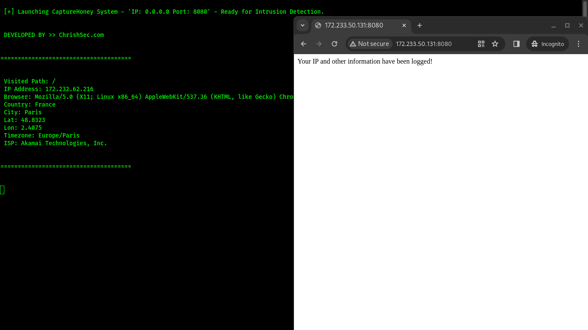
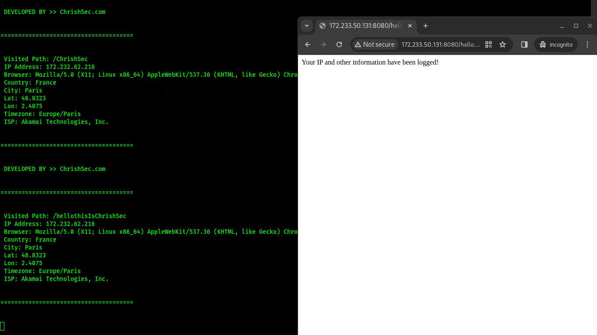
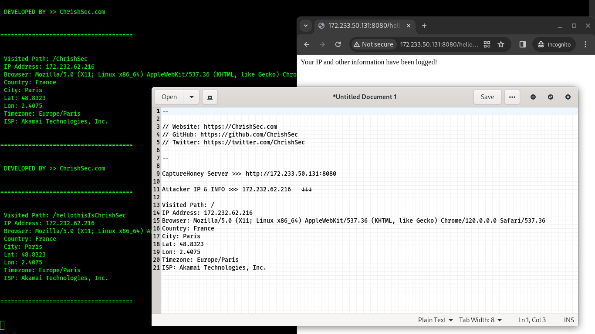

## CaptureHoney

`CaptureHoney` - Tool designed to capture and log connections, sending a custom message while offering no service to attackers. It operates as a Honeypot.

What is Honeypot? Click [here](https://en.wikipedia.org/wiki/Honeypot_(computing)) to know more.


### Requirements
- Python 3.x
- Unix-like operating system (tested on Ubuntu 20.04)

### Usage

1. Clone the repository:

```git clone https://github.com/ChrishSec/CaptureHoney.git```

2. Install the required dependencies:

```pip3 install -r requirements.txt```

3. Run the CaptureHoney.py:

```python3 CaptureHoney.py -ip 0.0.0.0 -p 8080 -timezone SG```

By default, CaptureHoney captures connections on IP address 0.0.0.0 and port 80. You can customize the IP, port, and timezone by modifying the relevant arguments in the command.

### Screenshots






```
--

// Website: https://ChrishSec.com
// GitHub: https://github.com/ChrishSec
// Twitter: https://twitter.com/ChrishSec

--

v2.0.0

CaptureHoney Server >>> http://172.xxx.xx.xxx:8080

Attacker IP & INFO >>> 172.xxx.xx.xxx   ↓↓↓ 

Connection Time: Jan 30, 2024 - 11:06:37 PM
Visited Path: /
IP Address: 172.xxx.xx.xxx
Browser: Mozilla/5.0 (X11; Linux x86_64) AppleWebKit/537.36 (KHTML, like Gecko) Chrome/120.0.0.0 Safari/537.36
Country: France
City: Paris
Lat: 48.xxxx
Lon: 2.xxxx
Timezone: Europe/Paris
ISP: Akamai Technologies, Inc.
```

## Disclaimer

This tool is intended for educational and research purposes only. Use it at your own risk. The author is not responsible for any damage caused by the use or misuse of this tool.

## License

This tool is released under the GNU General Public License v3.0. Everyone is permitted to copy and distribute verbatim copies of this license document, but changing it is not allowed.

## Author

This tool was developed by [ChrishSec](https://github.com/ChrishSec). Feel free to fork, modify, and distribute it. If you have any questions or suggestions, please reach out to the author on [Telegram](https://t.me/ChrishSec).
